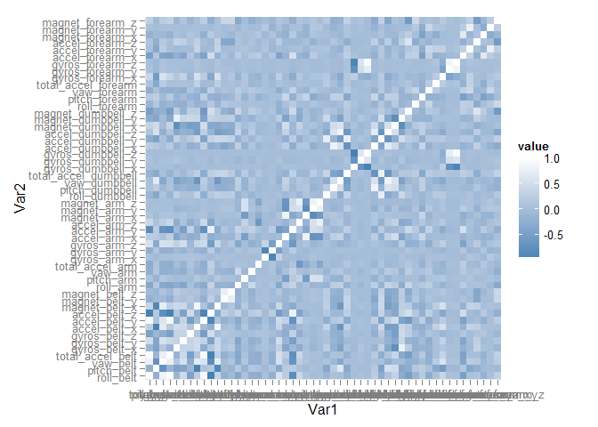

# Classification of fitness tracking data
Raghavendran Partha  
Friday, September 25, 2015  

In this project, I build a random forest classifier to classify the type of activity being perfomed, based on various physiological measurements of the subject performing the activity. The random forest classifier built performs robustly, with a very low out-of-sample error rate estimate, and successfully predicts the correct type of activity on 20 unforeseen testing data points.

#Loading data

```r
require(data.table)
require(caret)
require(dplyr)
require(reshape2)
require(ggplot2)
require(randomForest)
training_full <- data.frame(fread("pml-training.csv"))
testing <- data.frame(fread("pml-testing.csv"))
```

The data and the required packages are loaded. The Machine learning algorithm to be implemented in this project is classification using random forests.

#Data organization

```r
str(training_full)
```

```
## 'data.frame':	19622 obs. of  160 variables:
##  $ V1                      : chr  "1" "2" "3" "4" ...
##  $ user_name               : chr  "carlitos" "carlitos" "carlitos" "carlitos" ...
##  $ raw_timestamp_part_1    : int  1323084231 1323084231 1323084231 1323084232 1323084232 1323084232 1323084232 1323084232 1323084232 1323084232 ...
##  $ raw_timestamp_part_2    : int  788290 808298 820366 120339 196328 304277 368296 440390 484323 484434 ...
##  $ cvtd_timestamp          : chr  "05/12/2011 11:23" "05/12/2011 11:23" "05/12/2011 11:23" "05/12/2011 11:23" ...
##  $ new_window              : chr  "no" "no" "no" "no" ...
##  $ num_window              : int  11 11 11 12 12 12 12 12 12 12 ...
##  $ roll_belt               : num  1.41 1.41 1.42 1.48 1.48 1.45 1.42 1.42 1.43 1.45 ...
##  $ pitch_belt              : num  8.07 8.07 8.07 8.05 8.07 8.06 8.09 8.13 8.16 8.17 ...
##  $ yaw_belt                : num  -94.4 -94.4 -94.4 -94.4 -94.4 -94.4 -94.4 -94.4 -94.4 -94.4 ...
##  $ total_accel_belt        : int  3 3 3 3 3 3 3 3 3 3 ...
##  $ kurtosis_roll_belt      : chr  "" "" "" "" ...
##  $ kurtosis_picth_belt     : chr  "" "" "" "" ...
##  $ kurtosis_yaw_belt       : chr  "" "" "" "" ...
##  $ skewness_roll_belt      : chr  "" "" "" "" ...
##  $ skewness_roll_belt.1    : chr  "" "" "" "" ...
##  $ skewness_yaw_belt       : chr  "" "" "" "" ...
##  $ max_roll_belt           : num  NA NA NA NA NA NA NA NA NA NA ...
##  $ max_picth_belt          : int  NA NA NA NA NA NA NA NA NA NA ...
##  $ max_yaw_belt            : chr  "" "" "" "" ...
##  $ min_roll_belt           : num  NA NA NA NA NA NA NA NA NA NA ...
##  $ min_pitch_belt          : int  NA NA NA NA NA NA NA NA NA NA ...
##  $ min_yaw_belt            : chr  "" "" "" "" ...
##  $ amplitude_roll_belt     : num  NA NA NA NA NA NA NA NA NA NA ...
##  $ amplitude_pitch_belt    : int  NA NA NA NA NA NA NA NA NA NA ...
##  $ amplitude_yaw_belt      : chr  "" "" "" "" ...
##  $ var_total_accel_belt    : num  NA NA NA NA NA NA NA NA NA NA ...
##  $ avg_roll_belt           : num  NA NA NA NA NA NA NA NA NA NA ...
##  $ stddev_roll_belt        : num  NA NA NA NA NA NA NA NA NA NA ...
##  $ var_roll_belt           : num  NA NA NA NA NA NA NA NA NA NA ...
##  $ avg_pitch_belt          : num  NA NA NA NA NA NA NA NA NA NA ...
##  $ stddev_pitch_belt       : num  NA NA NA NA NA NA NA NA NA NA ...
##  $ var_pitch_belt          : num  NA NA NA NA NA NA NA NA NA NA ...
##  $ avg_yaw_belt            : num  NA NA NA NA NA NA NA NA NA NA ...
##  $ stddev_yaw_belt         : num  NA NA NA NA NA NA NA NA NA NA ...
##  $ var_yaw_belt            : num  NA NA NA NA NA NA NA NA NA NA ...
##  $ gyros_belt_x            : num  0 0.02 0 0.02 0.02 0.02 0.02 0.02 0.02 0.03 ...
##  $ gyros_belt_y            : num  0 0 0 0 0.02 0 0 0 0 0 ...
##  $ gyros_belt_z            : num  -0.02 -0.02 -0.02 -0.03 -0.02 -0.02 -0.02 -0.02 -0.02 0 ...
##  $ accel_belt_x            : int  -21 -22 -20 -22 -21 -21 -22 -22 -20 -21 ...
##  $ accel_belt_y            : int  4 4 5 3 2 4 3 4 2 4 ...
##  $ accel_belt_z            : int  22 22 23 21 24 21 21 21 24 22 ...
##  $ magnet_belt_x           : int  -3 -7 -2 -6 -6 0 -4 -2 1 -3 ...
##  $ magnet_belt_y           : int  599 608 600 604 600 603 599 603 602 609 ...
##  $ magnet_belt_z           : int  -313 -311 -305 -310 -302 -312 -311 -313 -312 -308 ...
##  $ roll_arm                : num  -128 -128 -128 -128 -128 -128 -128 -128 -128 -128 ...
##  $ pitch_arm               : num  22.5 22.5 22.5 22.1 22.1 22 21.9 21.8 21.7 21.6 ...
##  $ yaw_arm                 : num  -161 -161 -161 -161 -161 -161 -161 -161 -161 -161 ...
##  $ total_accel_arm         : int  34 34 34 34 34 34 34 34 34 34 ...
##  $ var_accel_arm           : num  NA NA NA NA NA NA NA NA NA NA ...
##  $ avg_roll_arm            : num  NA NA NA NA NA NA NA NA NA NA ...
##  $ stddev_roll_arm         : num  NA NA NA NA NA NA NA NA NA NA ...
##  $ var_roll_arm            : num  NA NA NA NA NA NA NA NA NA NA ...
##  $ avg_pitch_arm           : num  NA NA NA NA NA NA NA NA NA NA ...
##  $ stddev_pitch_arm        : num  NA NA NA NA NA NA NA NA NA NA ...
##  $ var_pitch_arm           : num  NA NA NA NA NA NA NA NA NA NA ...
##  $ avg_yaw_arm             : num  NA NA NA NA NA NA NA NA NA NA ...
##  $ stddev_yaw_arm          : num  NA NA NA NA NA NA NA NA NA NA ...
##  $ var_yaw_arm             : num  NA NA NA NA NA NA NA NA NA NA ...
##  $ gyros_arm_x             : num  0 0.02 0.02 0.02 0 0.02 0 0.02 0.02 0.02 ...
##  $ gyros_arm_y             : num  0 -0.02 -0.02 -0.03 -0.03 -0.03 -0.03 -0.02 -0.03 -0.03 ...
##  $ gyros_arm_z             : num  -0.02 -0.02 -0.02 0.02 0 0 0 0 -0.02 -0.02 ...
##  $ accel_arm_x             : int  -288 -290 -289 -289 -289 -289 -289 -289 -288 -288 ...
##  $ accel_arm_y             : int  109 110 110 111 111 111 111 111 109 110 ...
##  $ accel_arm_z             : int  -123 -125 -126 -123 -123 -122 -125 -124 -122 -124 ...
##  $ magnet_arm_x            : int  -368 -369 -368 -372 -374 -369 -373 -372 -369 -376 ...
##  $ magnet_arm_y            : int  337 337 344 344 337 342 336 338 341 334 ...
##  $ magnet_arm_z            : int  516 513 513 512 506 513 509 510 518 516 ...
##  $ kurtosis_roll_arm       : chr  "" "" "" "" ...
##  $ kurtosis_picth_arm      : chr  "" "" "" "" ...
##  $ kurtosis_yaw_arm        : chr  "" "" "" "" ...
##  $ skewness_roll_arm       : chr  "" "" "" "" ...
##  $ skewness_pitch_arm      : chr  "" "" "" "" ...
##  $ skewness_yaw_arm        : chr  "" "" "" "" ...
##  $ max_roll_arm            : num  NA NA NA NA NA NA NA NA NA NA ...
##  $ max_picth_arm           : num  NA NA NA NA NA NA NA NA NA NA ...
##  $ max_yaw_arm             : int  NA NA NA NA NA NA NA NA NA NA ...
##  $ min_roll_arm            : num  NA NA NA NA NA NA NA NA NA NA ...
##  $ min_pitch_arm           : num  NA NA NA NA NA NA NA NA NA NA ...
##  $ min_yaw_arm             : int  NA NA NA NA NA NA NA NA NA NA ...
##  $ amplitude_roll_arm      : num  NA NA NA NA NA NA NA NA NA NA ...
##  $ amplitude_pitch_arm     : num  NA NA NA NA NA NA NA NA NA NA ...
##  $ amplitude_yaw_arm       : int  NA NA NA NA NA NA NA NA NA NA ...
##  $ roll_dumbbell           : num  13.1 13.1 12.9 13.4 13.4 ...
##  $ pitch_dumbbell          : num  -70.5 -70.6 -70.3 -70.4 -70.4 ...
##  $ yaw_dumbbell            : num  -84.9 -84.7 -85.1 -84.9 -84.9 ...
##  $ kurtosis_roll_dumbbell  : chr  "" "" "" "" ...
##  $ kurtosis_picth_dumbbell : chr  "" "" "" "" ...
##  $ kurtosis_yaw_dumbbell   : chr  "" "" "" "" ...
##  $ skewness_roll_dumbbell  : chr  "" "" "" "" ...
##  $ skewness_pitch_dumbbell : chr  "" "" "" "" ...
##  $ skewness_yaw_dumbbell   : chr  "" "" "" "" ...
##  $ max_roll_dumbbell       : num  NA NA NA NA NA NA NA NA NA NA ...
##  $ max_picth_dumbbell      : num  NA NA NA NA NA NA NA NA NA NA ...
##  $ max_yaw_dumbbell        : chr  "" "" "" "" ...
##  $ min_roll_dumbbell       : num  NA NA NA NA NA NA NA NA NA NA ...
##  $ min_pitch_dumbbell      : num  NA NA NA NA NA NA NA NA NA NA ...
##  $ min_yaw_dumbbell        : chr  "" "" "" "" ...
##  $ amplitude_roll_dumbbell : num  NA NA NA NA NA NA NA NA NA NA ...
##   [list output truncated]
```

The dataset consists of 19622 observations of 160 variables. Each row of the dataset corresponds to various measurements of a subject performing a certain type of activity. The type of activity is encoded in the 'classe' variable. In addition to the measurements, auxiliary information such as name of the subject, time of measurement etc are also provided. 

#Data preprocessing

The activity variable 'classe' is stored as a character, and for ease of classification is converted to a factor variable. Additionally, for classification purposes, information other than the actual measurements would be of no use and hence are removed from the dataset. These correspond to the first 7 variables in the dataset.


```r
training_full <- mutate(training_full, classe=factor(classe))
training_full <- select(training_full,-c(1:7))
```

All measurements in the dataset are numeric. However, some of the variables (columns) contain junk values such as "#div!0". These columns can be identified as the ones with class 'character'. These variables are removed from the dataset


```r
inds <- character(0)
for(ii in 1:ncol(training_full)){
  inds[ii]<-class(training_full[,ii])
}
training_fulls <- select(training_full,which(inds!='character'))
```

In addition, several variables in the dataset are mostly empty (NA), i.e available only for very few rows. These are removed as well, and only the variables for which numeric values are available for all rows, are retained.


```r
fNas <- apply(training_fulls,2,function(x){
  mean(is.na(x))
})
training_fulls <- select(training_fulls,which(fNas==0))
```

This leaves us with a dataset of 19622 observations of 53 variables, including the 'classe' variable.


```r
str(training_fulls)
```

```
## 'data.frame':	19622 obs. of  53 variables:
##  $ roll_belt           : num  1.41 1.41 1.42 1.48 1.48 1.45 1.42 1.42 1.43 1.45 ...
##  $ pitch_belt          : num  8.07 8.07 8.07 8.05 8.07 8.06 8.09 8.13 8.16 8.17 ...
##  $ yaw_belt            : num  -94.4 -94.4 -94.4 -94.4 -94.4 -94.4 -94.4 -94.4 -94.4 -94.4 ...
##  $ total_accel_belt    : int  3 3 3 3 3 3 3 3 3 3 ...
##  $ gyros_belt_x        : num  0 0.02 0 0.02 0.02 0.02 0.02 0.02 0.02 0.03 ...
##  $ gyros_belt_y        : num  0 0 0 0 0.02 0 0 0 0 0 ...
##  $ gyros_belt_z        : num  -0.02 -0.02 -0.02 -0.03 -0.02 -0.02 -0.02 -0.02 -0.02 0 ...
##  $ accel_belt_x        : int  -21 -22 -20 -22 -21 -21 -22 -22 -20 -21 ...
##  $ accel_belt_y        : int  4 4 5 3 2 4 3 4 2 4 ...
##  $ accel_belt_z        : int  22 22 23 21 24 21 21 21 24 22 ...
##  $ magnet_belt_x       : int  -3 -7 -2 -6 -6 0 -4 -2 1 -3 ...
##  $ magnet_belt_y       : int  599 608 600 604 600 603 599 603 602 609 ...
##  $ magnet_belt_z       : int  -313 -311 -305 -310 -302 -312 -311 -313 -312 -308 ...
##  $ roll_arm            : num  -128 -128 -128 -128 -128 -128 -128 -128 -128 -128 ...
##  $ pitch_arm           : num  22.5 22.5 22.5 22.1 22.1 22 21.9 21.8 21.7 21.6 ...
##  $ yaw_arm             : num  -161 -161 -161 -161 -161 -161 -161 -161 -161 -161 ...
##  $ total_accel_arm     : int  34 34 34 34 34 34 34 34 34 34 ...
##  $ gyros_arm_x         : num  0 0.02 0.02 0.02 0 0.02 0 0.02 0.02 0.02 ...
##  $ gyros_arm_y         : num  0 -0.02 -0.02 -0.03 -0.03 -0.03 -0.03 -0.02 -0.03 -0.03 ...
##  $ gyros_arm_z         : num  -0.02 -0.02 -0.02 0.02 0 0 0 0 -0.02 -0.02 ...
##  $ accel_arm_x         : int  -288 -290 -289 -289 -289 -289 -289 -289 -288 -288 ...
##  $ accel_arm_y         : int  109 110 110 111 111 111 111 111 109 110 ...
##  $ accel_arm_z         : int  -123 -125 -126 -123 -123 -122 -125 -124 -122 -124 ...
##  $ magnet_arm_x        : int  -368 -369 -368 -372 -374 -369 -373 -372 -369 -376 ...
##  $ magnet_arm_y        : int  337 337 344 344 337 342 336 338 341 334 ...
##  $ magnet_arm_z        : int  516 513 513 512 506 513 509 510 518 516 ...
##  $ roll_dumbbell       : num  13.1 13.1 12.9 13.4 13.4 ...
##  $ pitch_dumbbell      : num  -70.5 -70.6 -70.3 -70.4 -70.4 ...
##  $ yaw_dumbbell        : num  -84.9 -84.7 -85.1 -84.9 -84.9 ...
##  $ total_accel_dumbbell: int  37 37 37 37 37 37 37 37 37 37 ...
##  $ gyros_dumbbell_x    : num  0 0 0 0 0 0 0 0 0 0 ...
##  $ gyros_dumbbell_y    : num  -0.02 -0.02 -0.02 -0.02 -0.02 -0.02 -0.02 -0.02 -0.02 -0.02 ...
##  $ gyros_dumbbell_z    : num  0 0 0 -0.02 0 0 0 0 0 0 ...
##  $ accel_dumbbell_x    : int  -234 -233 -232 -232 -233 -234 -232 -234 -232 -235 ...
##  $ accel_dumbbell_y    : int  47 47 46 48 48 48 47 46 47 48 ...
##  $ accel_dumbbell_z    : int  -271 -269 -270 -269 -270 -269 -270 -272 -269 -270 ...
##  $ magnet_dumbbell_x   : int  -559 -555 -561 -552 -554 -558 -551 -555 -549 -558 ...
##  $ magnet_dumbbell_y   : int  293 296 298 303 292 294 295 300 292 291 ...
##  $ magnet_dumbbell_z   : num  -65 -64 -63 -60 -68 -66 -70 -74 -65 -69 ...
##  $ roll_forearm        : num  28.4 28.3 28.3 28.1 28 27.9 27.9 27.8 27.7 27.7 ...
##  $ pitch_forearm       : num  -63.9 -63.9 -63.9 -63.9 -63.9 -63.9 -63.9 -63.8 -63.8 -63.8 ...
##  $ yaw_forearm         : num  -153 -153 -152 -152 -152 -152 -152 -152 -152 -152 ...
##  $ total_accel_forearm : int  36 36 36 36 36 36 36 36 36 36 ...
##  $ gyros_forearm_x     : num  0.03 0.02 0.03 0.02 0.02 0.02 0.02 0.02 0.03 0.02 ...
##  $ gyros_forearm_y     : num  0 0 -0.02 -0.02 0 -0.02 0 -0.02 0 0 ...
##  $ gyros_forearm_z     : num  -0.02 -0.02 0 0 -0.02 -0.03 -0.02 0 -0.02 -0.02 ...
##  $ accel_forearm_x     : int  192 192 196 189 189 193 195 193 193 190 ...
##  $ accel_forearm_y     : int  203 203 204 206 206 203 205 205 204 205 ...
##  $ accel_forearm_z     : int  -215 -216 -213 -214 -214 -215 -215 -213 -214 -215 ...
##  $ magnet_forearm_x    : int  -17 -18 -18 -16 -17 -9 -18 -9 -16 -22 ...
##  $ magnet_forearm_y    : num  654 661 658 658 655 660 659 660 653 656 ...
##  $ magnet_forearm_z    : num  476 473 469 469 473 478 470 474 476 473 ...
##  $ classe              : Factor w/ 5 levels "A","B","C","D",..: 1 1 1 1 1 1 1 1 1 1 ...
```

## Dropping correlated variables

Considering we have a high dimensional dataset of 52 predictors, we could look at the presence of correlated variables, and retaining only uncorrelated variables, thereby leading to a better performance. We ignore the outcome variable 'classe' (53rd column) from the correlation calculations. The findCorrelation function returns the columns which are highly correlated with others in the dataset, and hence can be dropped from the dataset.

The correlations between the variables in the dataset are shown in the following heatmap. This analysis removes 7 variables from the dataset, that are highly correlated (pearson's correlation > 0.9) with other variables.


```r
qplot(x=Var1, y=Var2, data=melt(cor(training_fulls[,-53])), fill=value, geom="tile") +scale_fill_gradient(low = "steelblue",high = "white")
```

 

```r
training_fulls <- select(training_fulls,-findCorrelation(cor(as.matrix(training_fulls[,-53]))))
dim(training_fulls)
```

```
## [1] 19622    46
```

# Model building

In this project, I build a random forest model for the classification of the type of activity - variable 'classe'. The full training data is first subdivided into sub-training and validation data, at a 70:30 split


```r
inTrain <- createDataPartition(training_fulls$classe, p = 0.7, list = FALSE)
training <- training_fulls[inTrain,]  
valid <- training_fulls[-inTrain,]
```

A random forest classifier is subsequently built on the sub-training data with the a bootstrap 632 method adopted to calculate the out-of-sample error estimate based on 25 bootstrapped resamples. The bootstrap 632 method overcomes some of the bias that often occurs in a naive bootstrap estimate. For each tree only 6 of the variables (sampled randomly) are used to construct the trees, to prevent overfitting.


```r
fitControl    <- trainControl(method = 'boot632')
tgrid           <- expand.grid(mtry=c(6)) 
model_boo6  <- train(classe ~ ., data = training, method = "rf", trControl = fitControl, tuneGrid = tgrid)
```

The out-of-sample error estimate is calculated by the model during the training process itself. It does so by using the training data rows that do not belong to a bootstrapped resample, and classifying those samples based on the tree built using that bootstrap resample. The average out-of-sample error estimate is then calculated similarly for all training data rows that were not used for constructing the trees in each bootstrapped resample.


```r
model_boo6$finalModel
```

```
## 
## Call:
##  randomForest(x = x, y = y, mtry = param$mtry) 
##                Type of random forest: classification
##                      Number of trees: 500
## No. of variables tried at each split: 6
## 
##         OOB estimate of  error rate: 0.58%
## Confusion matrix:
##      A    B    C    D    E class.error
## A 3899    2    3    1    1 0.001792115
## B   15 2638    5    0    0 0.007524454
## C    0   20 2373    3    0 0.009599332
## D    0    0   24 2227    1 0.011101243
## E    0    0    0    5 2520 0.001980198
```

The out-of-sample estimate (OOB) of error rate is 0.58%. This is the error expected on an unforeseen test set data. We can compare this estimate to the error on the validation dataset that was not used for training the model.


```r
validpred <- predict(model_boo6, newdata = valid)
confusionMatrix(valid$classe,validpred)
```

```
## Confusion Matrix and Statistics
## 
##           Reference
## Prediction    A    B    C    D    E
##          A 1672    2    0    0    0
##          B    5 1130    4    0    0
##          C    0    4 1022    0    0
##          D    0    0    7  957    0
##          E    0    0    0    1 1081
## 
## Overall Statistics
##                                           
##                Accuracy : 0.9961          
##                  95% CI : (0.9941, 0.9975)
##     No Information Rate : 0.285           
##     P-Value [Acc > NIR] : < 2.2e-16       
##                                           
##                   Kappa : 0.9951          
##  Mcnemar's Test P-Value : NA              
## 
## Statistics by Class:
## 
##                      Class: A Class: B Class: C Class: D Class: E
## Sensitivity            0.9970   0.9947   0.9894   0.9990   1.0000
## Specificity            0.9995   0.9981   0.9992   0.9986   0.9998
## Pos Pred Value         0.9988   0.9921   0.9961   0.9927   0.9991
## Neg Pred Value         0.9988   0.9987   0.9977   0.9998   1.0000
## Prevalence             0.2850   0.1930   0.1755   0.1628   0.1837
## Detection Rate         0.2841   0.1920   0.1737   0.1626   0.1837
## Detection Prevalence   0.2845   0.1935   0.1743   0.1638   0.1839
## Balanced Accuracy      0.9983   0.9964   0.9943   0.9988   0.9999
```

The accuracy of the predictions on the validation set is 99.58%, or equivalently the error rate is 0.42% which is comparable to the out-of-sample error rate estimate of the model (0.58%). The value also gives us the confidence in the prediction algorithm, as such a low out-of-sample error estimate would mean the algorithm should perform with reasonable success on a new dataset. 

A model trained on the full training set (no subsetting of training data) is subsequently used to classify the testing samples.


```r
model_boo6full  <- train(classe ~ ., data = training_fulls, method = "rf", trControl = fitControl, tuneGrid = tgrid)
model_boo6full$finalModel
```

```
## 
## Call:
##  randomForest(x = x, y = y, mtry = param$mtry) 
##                Type of random forest: classification
##                      Number of trees: 500
## No. of variables tried at each split: 6
## 
##         OOB estimate of  error rate: 0.33%
## Confusion matrix:
##      A    B    C    D    E  class.error
## A 5578    1    0    0    1 0.0003584229
## B   11 3782    3    0    1 0.0039504872
## C    0   15 3406    1    0 0.0046756283
## D    0    0   22 3191    3 0.0077736318
## E    0    0    1    5 3601 0.0016634322
```

```r
testPredboo6full <- predict(model_boo6full, newdata = testing)
```

The out-of-sample error rate estimate is similar to the one observed for the model built on the sub-training dataset. The predictions of the model on the 20 test cases are then submitted online, and compared to the truth, with a 100% success rate in predictions.
